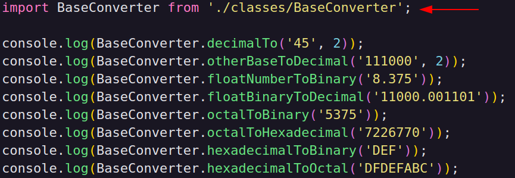
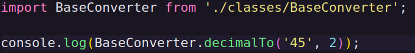
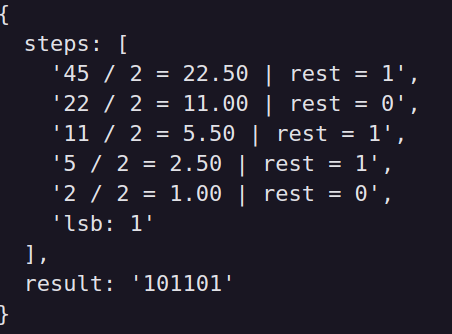

## Base converter

A class for converting numbers between bases, step by step

## Getting Started

install dependencies: <b>npm install</b>

use the <b>code runner</b> extension to run the project
link: https://marketplace.visualstudio.com/items?itemName=formulahendry.code-runner

## Built With

* [TypeScript](https://www.typescriptlang.org/) - Typed JavaScript

## Methods and how to use

<b>Call the class where you want to use</b>

<b>Decimal to other bases</b>

<b>return</b>

## License

This project is licensed under the MIT License - see the [LICENSE.md](LICENSE.md) file for details

